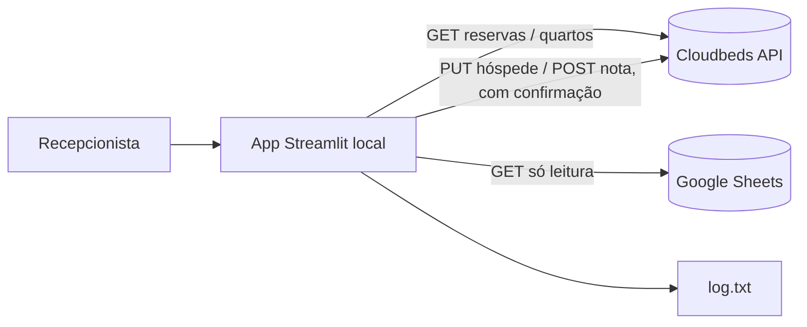

# Automação Recepção

Sistema local (Streamlit) que automatiza três tarefas repetitivas da recepção de um hotel que usa Cloudbeds como PMS — sempre pela API oficial, nunca simulando clique na tela do sistema.

## Problema

A recepção perde tempo em três tarefas manuais e sujeitas a erro:

1. Montar à mão uma planilha de ocupação dos próximos dias.
2. Redigitar dados de hóspedes que já existem numa planilha de controle (Google Sheets) direto no Cloudbeds.
3. Lembrar e registrar manualmente quantas vezes um hóspede já se hospedou.

## Solução

Um painel Streamlit com três funções independentes, todas apoiadas na API oficial do Cloudbeds:

| # | Função | Operação |
|---|--------|----------|
| 1 | Planilha de ocupação (N dias) | Só leitura |
| 2 | Autopreenchimento de hóspede | Leitura (Sheets) + escrita (só campos do hóspede) |
| 3 | Histórico de estadias na nota | Leitura (reservas) + escrita (só no campo da nota) |

**Regra de ouro: o sistema nunca faz DELETE em nada.** Nenhum endpoint de exclusão é usado em nenhuma das três funções.

### Como o match de hóspede evita erro

Casar hóspedes só pelo nome é arriscado (homônimos, acentos, abreviações). Por isso todo match automático exige nome parecido **e** um segundo dado batendo exatamente (CPF, telefone, e-mail ou data de nascimento):

- 1 candidato com nome parecido + segundo dado batendo → match confirmado.
- 2+ candidatos plausíveis → o sistema **nunca decide sozinho**, mostra as opções pra escolha manual.
- Nenhum candidato → avisa "não encontrado" e não faz nada.

### O que o sistema sempre faz antes de escrever

1. Lê primeiro, escreve depois — mostra "de → para" antes de qualquer gravação.
2. Pede confirmação explícita na tela.
3. Registra tudo em `log.txt` (o quê, quando, reserva/hóspede afetado).
4. Roda em modo teste (dry-run) por padrão — só simula, não grava, até ser desligado manualmente.

## Arquitetura



## Stack

| Camada | Tecnologia |
|---|---|
| Interface | Streamlit |
| PMS | API oficial Cloudbeds (v1.2) |
| Planilha de apoio | Google Sheets via `gspread` (só leitura) |
| Dados/export | pandas + openpyxl |
| Testes | pytest |
| Lint | ruff |
| CI | GitHub Actions |

## Instalando no computador da recepção (Windows)

1. **Instalar o Python**, se ainda não tiver: [python.org/downloads](https://www.python.org/downloads/) — na instalação, marque "Add Python to PATH".
2. **Baixar este projeto** no computador da recepção: em github.com/ronaldoribeirosm/automacao-recepcao, botão verde "Code" → "Download ZIP", e extrair numa pasta (ex.: `C:\AutomacaoRecepcao`). (Se preferir e tiver Git instalado, `git clone` funciona igual.)
3. **Criar o arquivo de credenciais**: dentro da pasta, copie `.env.example` e renomeie a cópia pra `.env`. Abra no bloco de notas e preencha `CLOUDBEDS_API_KEY` e `CLOUDBEDS_PROPERTY_ID` com os valores reais — **digite direto ali**, não envie a chave por e-mail/WhatsApp/etc.
4. **Dar dois cliques em `iniciar.bat`**. Na primeira vez ele demora um pouco (baixando as dependências); depois disso abre em segundos, direto no navegador.

O modo **dry-run** vem ligado por padrão — nenhuma escrita real acontece no Cloudbeds até alguém desligar isso conscientemente na barra lateral, depois de validar que as simulações fazem sentido.

## Rodando localmente (linha de comando)

```bash
python -m venv .venv
.venv\Scripts\activate
pip install -r requirements.txt

copy .env.example .env
# preencher .env com as credenciais reais

streamlit run app.py
```

## Escopos necessários no Cloudbeds

Ao gerar a API key em *Account → Apps & Marketplace → New Credentials*, selecione:

- Reserva (Ler)
- Hóspede (Ler/Escrever)
- Campos Personalizados (Ler/Escrever)
- Acomodação (Ler)

## Testes

```bash
python -m pytest
ruff check .
```

## Licença

MIT — veja [LICENSE](LICENSE).
