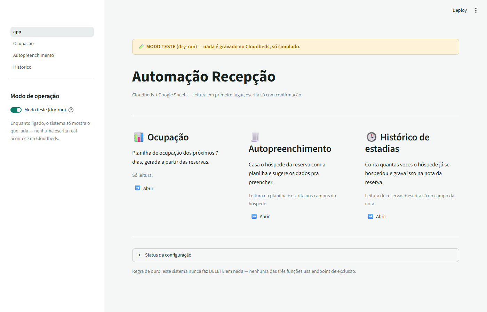
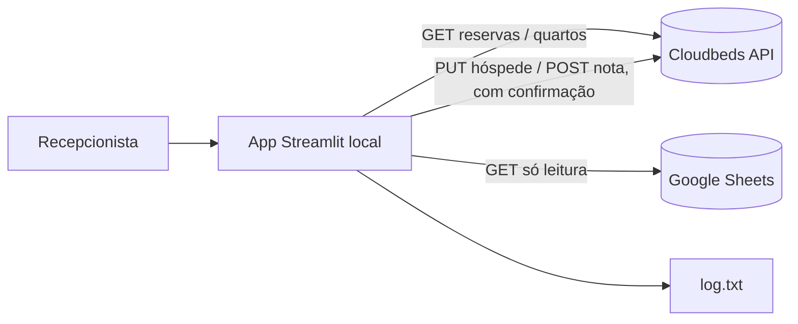
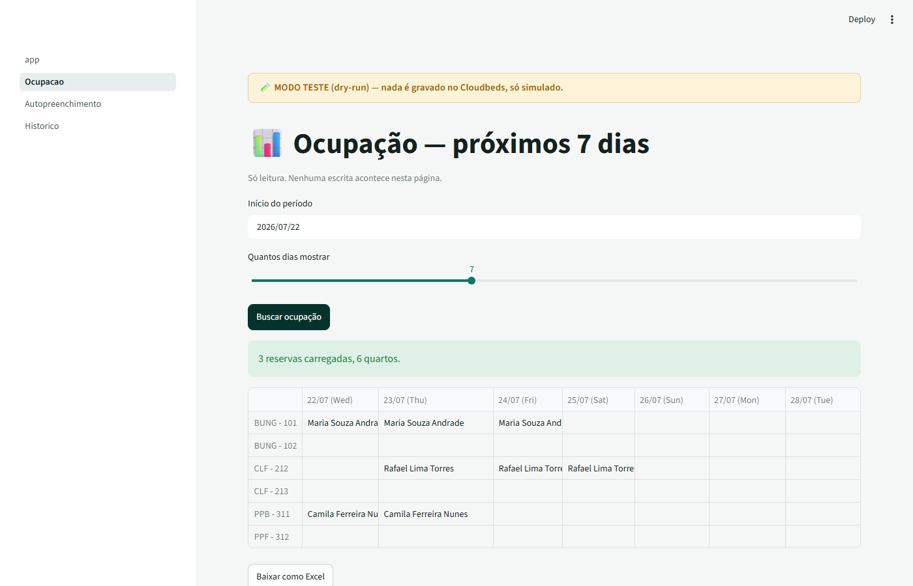
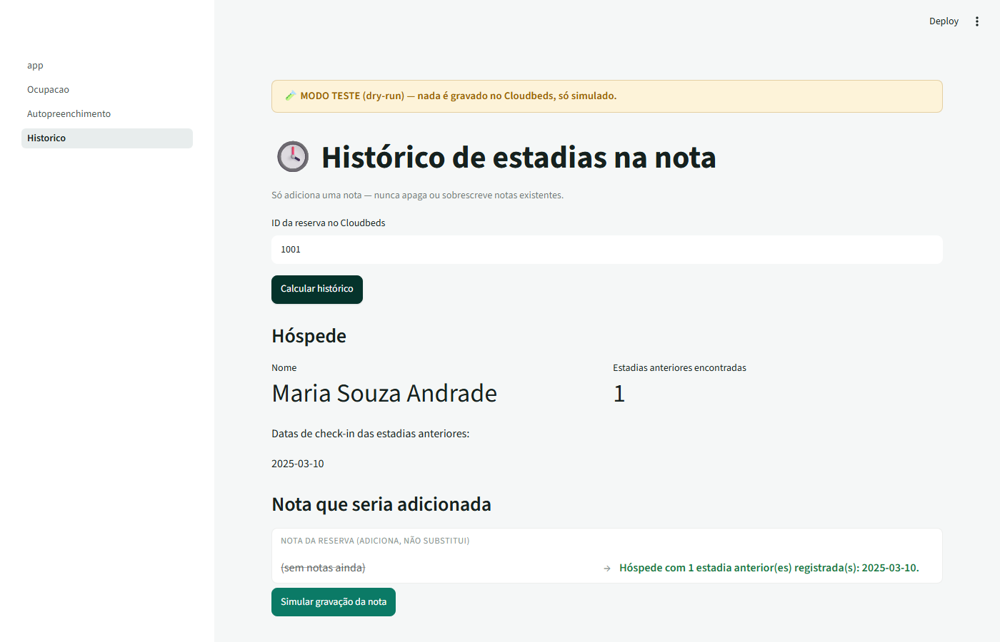

# Automação Recepção


Automação de recepção hoteleira via API oficial do Cloudbeds — ocupação, autopreenchimento de hóspede e histórico de estadias, sempre com confirmação humana antes de qualquer gravação.



## Links

- Não há demo pública: o sistema roda localmente e se conecta à conta real do Cloudbeds de um hotel — publicar um demo exigiria expor dados de hóspede. Os prints abaixo usam dados 100% fictícios.
- [Documentação da API do Cloudbeds](https://developers.cloudbeds.com/) — base oficial usada neste projeto.
- [Como rodar localmente](#como-rodar-localmente) e [decisões técnicas](#decisões-técnicas) mais abaixo.

## O problema

A recepção perde tempo em três tarefas manuais e sujeitas a erro:

1. Montar à mão uma planilha de ocupação dos próximos dias.
2. Redigitar dados de hóspedes que já existem numa planilha de controle (Google Sheets) direto no Cloudbeds.
3. Lembrar e registrar manualmente quantas vezes um hóspede já se hospedou.

## A solução

Um painel Streamlit com três funções independentes, todas apoiadas na API oficial do Cloudbeds — nunca simula clique na tela do sistema:

| # | Função | Operação |
|---|--------|----------|
| 1 | Planilha de ocupação (N dias) | Só leitura |
| 2 | Autopreenchimento de hóspede | Leitura (Sheets) + escrita (só campos do hóspede) |
| 3 | Histórico de estadias na nota | Leitura (reservas) + escrita (só no campo da nota) |

**Regra de ouro: o sistema nunca faz DELETE em nada.** Nenhum endpoint de exclusão é usado em nenhuma das três funções.



Casar hóspedes só pelo nome é arriscado (homônimos, acentos, abreviações). Por isso todo match automático exige nome parecido **e** um segundo dado batendo exatamente (CPF, telefone, e-mail ou data de nascimento):

- 1 candidato com nome parecido + segundo dado batendo → match confirmado.
- 2+ candidatos plausíveis → o sistema **nunca decide sozinho**, mostra as opções pra escolha manual.
- Nenhum candidato → avisa "não encontrado" e não faz nada.

E antes de qualquer escrita: lê primeiro, mostra "de → para" na tela, pede confirmação explícita, registra tudo em `log.txt`, e roda em modo teste (dry-run) por padrão até alguém desligar isso conscientemente.

## Prints — o sistema rodando

Ocupação lendo reservas reais do Cloudbeds e montando a grade por quarto/dia:



Histórico contando estadias anteriores e montando a nota antes de confirmar:



Exemplo (simplificado, com dados fictícios) do formato real que o `getReservation` do Cloudbeds devolve — o hóspede principal fica dentro de `guestList`, não na raiz:

```json
{
  "reservationID": "1001",
  "guestName": "Maria Souza Andrade",
  "guestEmail": "maria.souza@example.com",
  "status": "confirmed",
  "startDate": "2026-07-22",
  "endDate": "2026-07-25",
  "assigned": [
    { "roomName": "BUNG - 101", "startDate": "2026-07-22", "endDate": "2026-07-25" }
  ],
  "guestList": {
    "g1": {
      "guestID": "g1",
      "isMainGuest": true,
      "guestPhone": "+55 11 98888-1234",
      "guestDocumentNumber": "",
      "guestBirthdate": ""
    }
  }
}
```

E o `getGuestList`, que filtra de verdade por e-mail/telefone no servidor (a peça-chave da função de histórico — veja [decisões técnicas](#decisões-técnicas)):

```json
// GET getGuestList?guestEmail=maria.souza@example.com
{
  "success": true,
  "data": [
    { "reservationID": "900" },
    { "reservationID": "1001" }
  ]
}
```

## Stack

| Camada | Tecnologia |
|---|---|
| Interface | Streamlit |
| PMS | API oficial Cloudbeds (v1.2) |
| Planilha de apoio | Google Sheets via `gspread` (só leitura) |
| Dados/export | pandas + openpyxl |
| Testes | pytest + `streamlit.testing.v1.AppTest` |
| Lint | ruff |
| CI | GitHub Actions |

## Como rodar localmente

### Desenvolvimento

```bash
python -m venv .venv
.venv\Scripts\activate
pip install -r requirements.txt

copy .env.example .env
# preencher .env com as credenciais reais

streamlit run app.py
```

### No computador da recepção (sem terminal)

1. **Instalar o Python**, se ainda não tiver: [python.org/downloads](https://www.python.org/downloads/) — marque "Add Python to PATH" na instalação.
2. **Baixar este projeto**: botão verde "Code" → "Download ZIP" nesta página, e extrair numa pasta.
3. **Criar o arquivo de credenciais**: copie `.env.example`, renomeie pra `.env`, e preencha `CLOUDBEDS_API_KEY`/`CLOUDBEDS_PROPERTY_ID` direto ali — nunca envie a chave por e-mail/WhatsApp.
4. **Dois cliques em `iniciar.bat`.** Na primeira vez demora um pouco (instala as dependências); depois abre em segundos.

O modo **dry-run** vem ligado por padrão — nenhuma escrita real acontece no Cloudbeds até alguém desligar isso conscientemente na barra lateral, depois de validar que as simulações fazem sentido.

## Decisões técnicas

### A API real diverge da documentação pública

O projeto começou seguindo a [documentação oficial](https://developers.cloudbeds.com/), mas testar contra a conta real de um hotel (Cloudbeds v1.2) revelou várias diferenças que só apareceriam em produção:

- `getReservations` devolve `count` (itens *desta página*) separado de `total` (o total real) — usar `count` como total faz a paginação parar cedo demais.
- `getRooms` agrupa os quartos por propriedade (`data: [{ rooms: [...] }]`), mesmo com uma propriedade só — não é uma lista simples.
- `getReservation` só tem `guestName`/`guestEmail` na raiz. Telefone, documento, data de nascimento e endereço ficam dentro de `guestList`, indexado por `guestID` — daí a função `extract_main_guest()`.
- A atribuição de quarto/data (`assigned`, com `startDate`/`endDate`) só existe no `getReservation` individual — a lista (`getReservations`) não traz isso.
- O campo de nota da reserva se chama `reservationNote`, não `note`.

Nenhuma dessas diferenças aparece claramente na documentação — só apareceram testando com uma API key real. Isso motivou a estratégia de testes descrita [abaixo](#testes).

### Histórico de estadias: de 2+ minutos travado pra 3,3 segundos

O desenho inicial buscava todas as reservas dos últimos N anos e comparava e-mail/telefone reserva por reserva. Contra a conta real (mais de 10 mil reservas em 5 anos, e `getReservations` ignora filtro por e-mail/telefone), isso significava paginar mais de 100 páginas e ainda detalhar cada candidato — um teste real passou de 2 minutos sem terminar.

A solução foi descobrir que `getGuestList` **filtra de verdade no servidor** por `guestEmail`/`guestPhone` (confirmado com uma chamada real). O redesenho busca só os hóspedes com aquele e-mail/telefone exato — poucos resultados, quase instantâneo — em vez de escanear a propriedade inteira. Resultado medido contra dados reais: **3,3 segundos**.

### Match de hóspede nunca decide sozinho — nem quando os dados empatam

A regra de segurança do projeto é que dois candidatos plausíveis nunca devem ser resolvidos automaticamente. Um teste de integração (`AppTest`, ver [testes](#testes)) simulando dois homônimos com nome, similaridade *e* segundo dado idênticos achou um bug real: os rótulos do rádio de escolha colidiam (texto igual pros dois), e o usuário não conseguia de fato escolher entre eles. A correção usa o índice da lista como valor da opção (não o texto formatado) — o rótulo pode repetir, a seleção nunca.

### Ocupação: N+1 chamadas aceitas conscientemente

Como a atribuição de quarto só vem no `getReservation` individual, montar a grade de ocupação exige: 1 chamada de lista (barata, filtrada por data) + 1 chamada de detalhe por reserva candidata. Pra uma janela de 7 dias isso significa dezenas de chamadas (não milhares) — aceitável para uso interativo ocasional, com um spinner indicando progresso ("Detalhando N reservas…"). Paralelizar isso é a otimização mais óbvia se a propriedade crescer muito (ver [o que eu faria diferente](#o-que-eu-faria-diferente)).

### Dry-run como padrão, não como opção

Todo o caminho de escrita (`put_guest`, `post_reservation_note`) é dry-run por padrão e só grava de verdade com `dry_run=False` explícito, passado pela UI depois de o usuário desligar conscientemente o modo teste. Em dry-run, a função nunca chega a chamar a rede — o mesmo código de produção roda, só sem o `requests.request` final.

## Testes

23 testes automatizados, em duas camadas:

- **Lógica pura** (`core/matching.py`, `core/history.py`, `core/occupancy.py`): normalização de nome/acento, desempate por segundo dado, contagem de estadias, montagem da grade — a parte mais crítica pra segurança (nunca casar o hóspede errado) tem a cobertura mais pesada.
- **Integração de página** (`tests/test_pages_integration.py`, via `streamlit.testing.v1.AppTest`): simula clique de botão, preenchimento de campo e escolha no rádio contra o código real das 3 páginas — Cloudbeds/Sheets são substituídos por dados fake nesse nível, mas sessão, diff, confirmação e gravação em dry-run são código de produção rodando de verdade.

Essa segunda camada não é só formalidade: foi ela que achou os dois bugs reais descritos em [decisões técnicas](#decisões-técnicas) (pré-preenchimento errado do segundo dado, e colisão de rótulo no rádio de ambiguidade) antes de irem pra produção.

```bash
python -m pytest
ruff check .
```

## O que eu faria diferente

- Testaria contra a API real desde o primeiro dia, em vez de confiar só na documentação pública — os 6 desvios encontrados (ver decisões técnicas) teriam sido descobertos mais cedo e mais barato.
- Paralelizaria as chamadas de detalhe da Ocupação (hoje sequenciais, ~17s pra 33 reservas) com um pool de threads, já que são todas leituras independentes.
- Validaria os dois endpoints de escrita (`putGuest`, `postReservationNote`) contra uma reserva de teste real antes de chamar o sistema de "pronto pra produção" — hoje eles só foram exercitados em dry-run (nunca gravaram de verdade).
- Adicionaria um teste de contrato (schema) contra respostas reais gravadas da API, pra pegar futuras mudanças de formato do Cloudbeds automaticamente, em vez de descobrir na mão de novo.

## Licença

MIT — veja [LICENSE](LICENSE).
